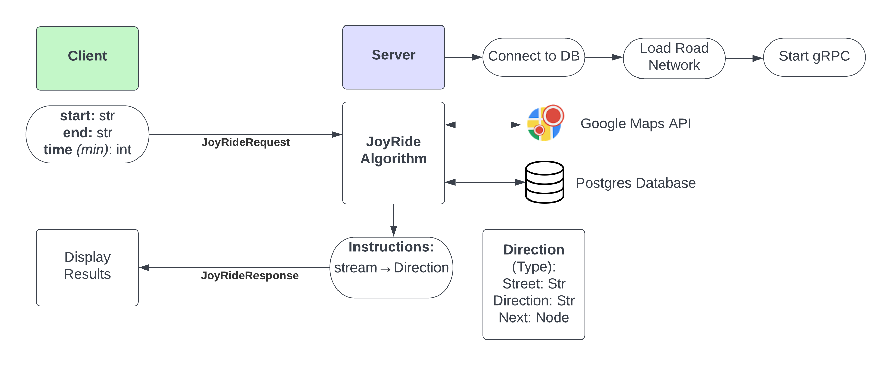

# Joy Ride

## Setup
Run `pip3 install -r requirements.txt` to install all needed Python3 dependencies.

Make sure to run `./gen_grpc.sh` whenever a proto is modified. This re-generates needed GRPC files
for the Python client and server.

### Database:
Run `docker compose up` to start the Postgres database.

### Server:
Run `./start_server.sh <port> 
 <radius>`.

### Application:
Run `./start_client.sh <port>` to start the client application.
